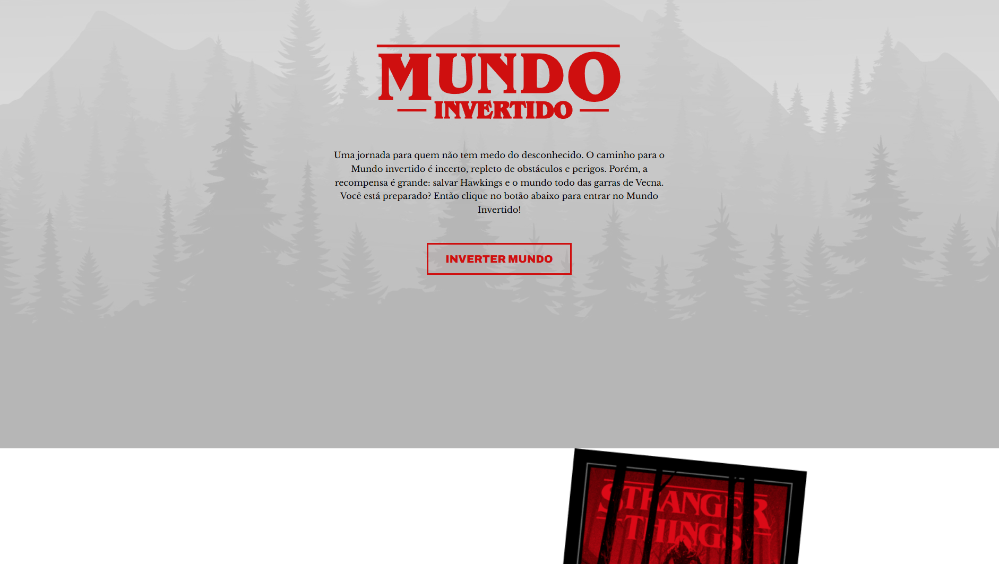

  <h1>🌍 Projeto Mundo Invertido</h1>
  
Landing page web com tema inspirado na série “Stranger Things”, desenvolvida usando HTML, CSS e JavaScript.

---

## 📌 Sobre o Projeto

O **Projeto Mundo Invertido** é uma *landing page* interativa criada com HTML, CSS e JavaScript que traz uma experiência visual temática inspirada no mundo fictício da série *Stranger Things*. O propósito é demonstrar habilidades em layout, estilização visual, efeitos e responsividade, aplicando os conceitos fundamentais de desenvolvimento Frontend. :contentReference[oaicite:1]{index=1}

Este projeto foi criado durante estudos e desafios de Frontend para reforçar a compreensão de estrutura, semântica e estilos, além de manipulação básica do DOM. :contentReference[oaicite:2]{index=2}

---

---

## 📸 Preview da Aplicação

  

---

## 🎯 Objetivo do Projeto

O objetivo principal foi aplicar e reforçar conhecimentos de Frontend, incluindo:

- Estruturação semântica e organizada com HTML  
- Estilização visual e efeitos com CSS  
- Interatividade básica com JavaScript  
- Layout adaptável e responsivo para diferentes telas  

Esse tipo de projeto é excelente para treinar fundações do desenvolvimento web e criar experiências visuais envolventes para usuários. :contentReference[oaicite:3]{index=3}

---

## 🚀 Funcionalidades

- Layout visualmente temático e responsivo  
- Navegação entre seções da página  
- Estilização CSS consistente  
- Elementos visuais e interativos criando experiência imersiva  

---

## 🛠️ Tecnologias Utilizadas

| Tecnologia | Aplicação no projeto |
|------------|----------------------|
|  **HTML5** | Estrutura semântica da página |
|  **CSS3** | Estilização visual e layout responsivo |
|  **JavaScript** | Interatividade e manipulação da interface |

---

## 📈 Aprendizados e Evolução Técnica

Durante a construção deste projeto, consolidei:

- Estruturação clara de páginas web  
- Uso de CSS para criar temas e efeitos visuais  
- Aplicação de JavaScript para interação básica  
- Organização de pastas para recursos e estilos  
- Responsividade e adaptação para diferentes dispositivos  

---

⭐ Se este projeto chamou sua atenção, fique à vontade para explorar o código e experimentar o deploy!

